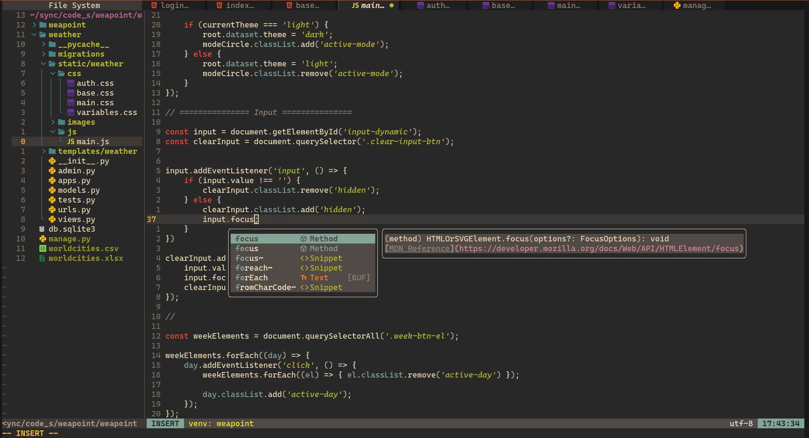

# Конфігурація NeoVim на Lua


<br>




## Пакети для встановлення

### Основні пакети:
- **lua** -> мова програмування
- **nvim** -> текстовий редактор

### Для коректної роботи LSP-сервера:
- **clang** -> LSP-сервер для мов C/C++
- **npm** -> пакет для працювання із JS/TS

## Використані плагіни
1. **cmp** -> підсказки при написанні коду
2. **lsp** -> інтеграція із LSP-серверами
3. **nvim-tree** -> дерево файлової структури для взаємодії та переміщення по ній
4. **lualine** -> можливість відображати інформацію у окремому барі
5. **bufferline** -> керування буферами (вкладками)
6. **comment** -> закоментовування коду завдяки комбінаціям клавіш
7. **colorizer** -> розфарбовування назви кольорів у їх колір
8. **autoclose** -> автоматично закриває дужки та лапки
9. **luasnip** -> готові синтаксичні конструкції для різних мов програмування
10. **markdown-preview** -> можливість у браузері бачити результат для Markdown файлів
11. **gruvbox** -> тема для NeoVim

## Встановлення конфігурації

**1. Встановлюємо пакети**
```sh
sudo pacman -S lua nvim clang npm
```

**2. Клонуємо репозиторій**
```sh
git clone https://github.com/Ilya-MAO/NeoVim-config.git "$PATH/.config/nvim/"
```
